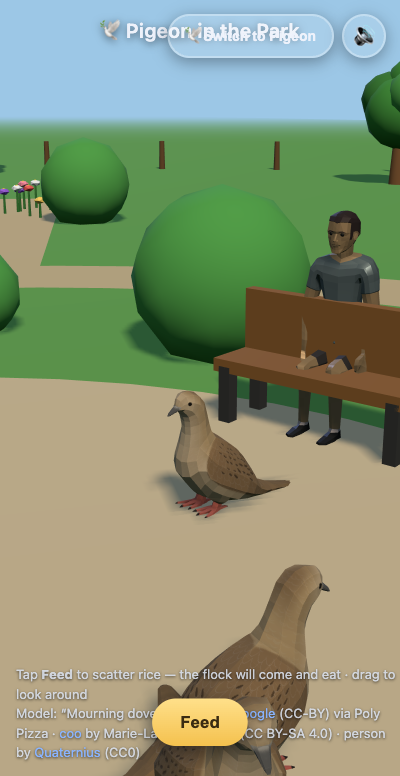

# Pigeon in the Park 🐦

You are a pigeon. There is a park. You walk around. That's basically it.



## What?

A tiny 3D park where you waddle a pigeon around while other pigeons wander and peck at things. Profound stuff.

## Running it

```bash
npm install
npm run dev
```

Then open the thing in your browser and coo responsibly.

## Controls

- Move around
- Be a pigeon

That's the whole README. Go forth and peck.
